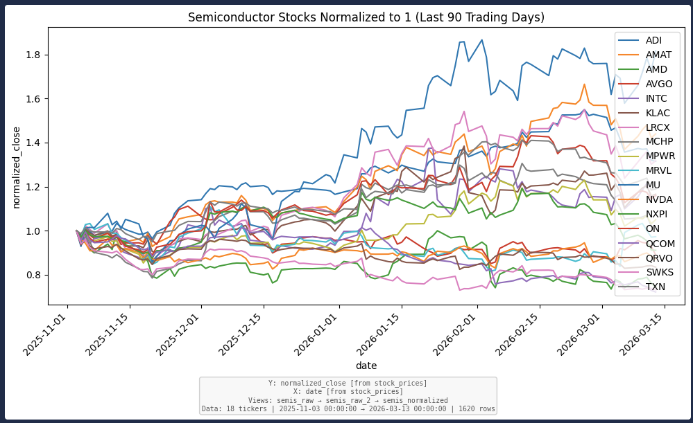
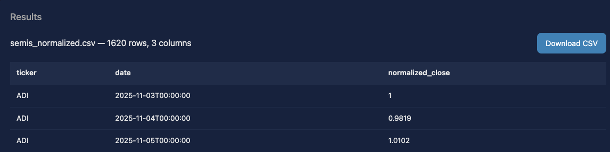
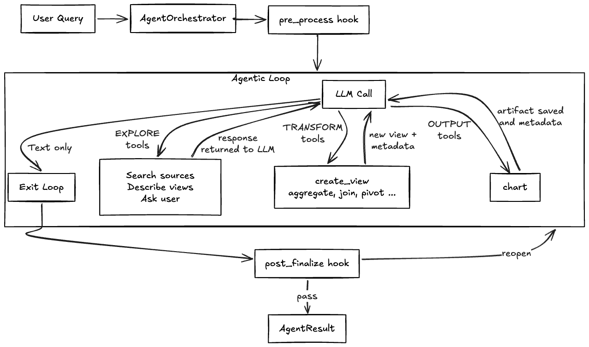

# agentic_TRACE

**TRACE: Tool-Routed Architecture for Controlled Execution**

A framework for building LLM-powered data-analysis agents where the LLM orchestrates but doesn't  touch your data. Domain-agnostic core; [`examples/stocks/`](examples/stocks/) is a complete working application built on top of it.

[](https://buymeacoffee.com/eric_glover)
[](https://appliedingenuity.substack.com)
[](LICENSE)

---

## Table of Contents

1. [Why TRACE?](#why-trace)
2. [How It Works](#how-it-works)
3. [See It In Action](#see-it-in-action)
4. [Quick Start](#quick-start)
5. [Architecture](#architecture)
6. [Core Components](#core-components)
7. [Extending the Framework](#extending-the-framework)
8. [Configuration Reference](#configuration-reference)
9. [Directory Structure](#directory-structure)

---

## Why TRACE?

"LLM-as-analyst" demos are deceptively dangerous.

Give an LLM an SQL tool and ask it to analyze your data — the demo looks incredible. But under the surface, these systems have critical failure modes that make them unsuitable for any decision that matters:

- **The helpfulness paradox** : When a database query fails silently, the LLM doesn't stop. It fabricates plausible-looking data to satisfy your request. A system that fails by making stuff up is a catastrophic liability.
- **Probabilistic math** : LLMs don't run equations. They predict probable token sequences. The correct number retrieved from your database can be transposed, rounded, or simply made up in the final output.
- **Context window degradation** : Research shows catastrophic accuracy collapse when prompts exceed 40-50% of context length. Dumping raw data into the conversation makes this worse with every turn.
- **Cost explosion** : The entire conversation thread, including raw database results, must be resent on every LLM call. A single complex query can balloon to 50,000+ tokens.
- **No audit trail** : The final output looks identical whether it came from your database, a correct calculation, or a hallucination.

> Read the full analysis: [The LLM-as-Analyst Trap: A Technical Deep-Dive](https://appliedingenuity.substack.com/p/the-llm-as-analyst-trap-a-technical)

TRACE solves this by shifting the LLM from **oracle to orchestrator**.

---

## How It Works

TRACE enforces a strict separation: the LLM decides *what* to do; deterministic tools do the actual work. Three core principles:

**1. The LLM sees metadata, never data.**
After every tool call, the LLM receives column names, row counts, statistics (min/max/mean), and warnings, not raw DataFrames. This keeps prompts small (faster, cheaper, less hallucination risk) and makes it structurally impossible for the LLM to fabricate data values.

**2. All computation is deterministic.**
Filtering, aggregation, joins, indicator calculations, and charting are executed by code, not by token prediction. The same inputs always produce the same outputs.

**3. Every step is auditable.**
Each view records its parent views, the tool that created it, and the parameters used. Provenance files trace any output column back to its source. The audit trail is generated by the execution engine, not the LLM.

The result: prompts that can be significantly smaller than raw-data approaches, zero data-specific hallucination risk, full audit trails, and the ability to run on smaller (including local) models.

> Read about the Agentic TRACE pattern: [The Verifiable Orchestrator: A New Agentic Pattern](https://appliedingenuity.substack.com/p/the-verifiable-orchestrator-a-new)

**This is a framework, not just an app.** The core is domain-agnostic, you can subclass the tools, register your data sources, write a domain-specific prompt, and you have a verifiable agent for your own data domain.

---

## See It In Action

The included [stock market example](examples/stocks/) demonstrates the full pattern: natural language queries produce verified, auditable financial analysis.

**Example query:**
```
Plot the semiconductor stocks, normalized to 1, for the last 90 trading days
```


Figure 1: The generated chart when run on March 15, 2026 for the query: `Plot the semiconductor stocks, normalized to 1, for the last 90 trading days`

Figure 2: A screen shot from the web UI of the downloadable .csv file (first 3 lines). Using this framework the data is guaranteed to be computed correctly and can never be hallucinated. There are 1620 rows of data.

The above query took about 7 seconds to run when using Gemini 3.1-flash-lite, and required only 43,822 total tokens, with a max single context window of 7,162, estimated cost is about 1 US cent. There were only 339 required output tokens. Running the "simple agentic approach" would require thousands of tokens to represent the raw result data. Without running the post-validation, it would have taken about 6 seconds and cost even less.

What happens under the hood:
1. `explore` → search the database for companies or stock-groups that mention "semiconductors"
2. `resolve_time` → converts "last 90 trading days" to actual market dates from the database
3. `create_view` → filters stock_prices for semiconductor tickers in that date range, using the groupname SEMICONDUCTORS, found via search. The tickers in this group could change over time, but this will always reflect the current truth.
4. `aggregate` → computes normalization baseline (first close per ticker)
5. `create_view` → adds normalized price column
6. `chart` → renders a line chart with full provenance annotation
7. `post validation` → A secondary check to confirm the user's query was properly answered.

Every intermediate step produces a named view with full metadata. The final chart includes a provenance annotation tracing exactly how each data point was derived.

---

## Quick Start

**Prerequisites:** Python 3.10+, pip

### 1. Install

(we recommend in a virtual environment)

```bash
git clone https://github.com/ericglover/agentic_TRACE.git
cd agentic_TRACE
pip install -e .
```

### 2. Set up the stock market example

```bash
# Create database and load seed data (companies, groups, equations)
python -m examples.stocks.load_data

# Download stock price history from Yahoo Finance
python examples/stocks/scripts/data_loader.py --db examples/stocks/data/market.duckdb
```

### 3. Configure your LLM

**Google Gemini (free tier available):**
```bash
# Get a free API key at https://aistudio.google.com/apikey
export GEMINI_API_KEY="AIza..."
cp examples/stocks/configs/gemini_3_1_flash_lite.example.yaml examples/stocks/configs/gemini_3_1_flash_lite.yaml
```

**Anthropic Claude:**
```bash
# Get an API key at https://console.anthropic.com (requires API credits, separate from Claude Pro/Max subscription)
export ANTHROPIC_API_KEY="sk-ant-..."
cp examples/stocks/configs/anthropic_sonnet.example.yaml examples/stocks/configs/anthropic_sonnet.yaml
```

For local models (llama.cpp, Ollama, vLLM), see the [stocks example README](examples/stocks/README.md#llm-configuration).

### 4. Run

**CLI:**
```bash
# With Gemini
python -m examples.stocks.run "Swhen was the high and and at what value as well as what was the percent change on that date from the start for each homebuilder stock in 2025" --config examples/stocks/configs/gemini_3_1_flash_lite.yaml

# With Anthropic
python -m examples.stocks.run "when was the high and and at what value as well as what was the percent change on that date from the start for each homebuilder stock in 2025" --config examples/stocks/configs/anthropic_sonnet.yaml
```

**Web UI:**
```bash
python -m examples.stocks.web_app --port 8000
# Open http://localhost:8000
```

---

## Architecture



### Three Tool Categories

At each iteration, the LLM either responds with text (ending the loop) or makes tool calls:

**EXPLORE** — Gathers information without producing new data. Search available sources, describe a view's schema, or ask the human a clarifying question. Results are returned to the LLM as metadata.

**TRANSFORM** — Creates or reshapes data. Each call produces a named **view** (DataFrame + metadata). Views compose into a DAG. Setting `finalize=True` marks a view as final output (CSV download).

**OUTPUT** — Produces artifacts from existing views without creating new ones. The primary example is `chart`, which renders a PNG with provenance annotations.

### Metadata, Not Data

The LLM never sees raw DataFrames. After each tool call, it receives:

1. **Tool result metadata** — view name, row count, column names, per-column statistics (min/max/mean/nulls), warnings
2. **Session state** — all views created so far with their shapes and finalization status

Raw DataFrames live only in `Session._dataframes` (in-process memory) and are never serialized into messages. This is what makes TRACE prompts small and hallucination-resistant.

### Loop Behaviors

- **Auto-finalize**: If the LLM stops without `finalize=True`, the last-modified view is auto-finalized
- **Loop detection**: Same tool + same args 3+ times → warn, then halt
- **`??` guard**: Unresolved placeholders in tool args → immediate error without execution
- **Human-in-the-loop**: The LLM can ask clarifying questions; the orchestrator blocks until the user responds
- **Self-correction**: `post_finalize` hook can reopen the session for another pass if validation finds issues

---

## Core Components

### `agent/orchestrator.py` — AgentOrchestrator
The main loop. Coordinates LLM calls, tool dispatch, streaming events, lifecycle hooks, and session persistence.

### `core/session.py` — Session + DomainConfig
Per-run state container holding views (metadata + DataFrames), execution log, and finalized outputs. `DomainConfig` provides domain-specific settings for lineage labels, entity detection, and partition auto-detection.

### `tools/base.py` — BaseTool
Abstract base for all tools. Subclasses implement `parameters()` and `execute()`. Helper methods (`validate_view_exists`, `validate_columns_exist`, `success`, `error`) keep implementations concise. Overridable hint methods (`_hint_mode_required`, `_hint_low_row_warning`, etc.) let domain subclasses inject LLM-friendly examples into error messages.

### `tools/registry.py` — ToolRegistry
Manages tool instances and generates LLM-facing schemas via `to_openai_functions()`.

### `data/sources.py` — DataSource / SourceRegistry
Abstract interface for data backends. Built-in adapter: `DuckDBSource`. Source schemas are auto-injected into the system prompt.

### `config/prompts.py` — PromptBuilder
Composes the system prompt from base text, data source schemas, tool descriptions, few-shot examples, and custom domain sections.

### `core/lineage.py` — Column Lineage
Traces column derivations through the view DAG. Produces chart annotations and provenance files. Best-effort — never blocks operations.

### `config/llm.py` — LLMConfig / LLMProvider
YAML-configured LLM settings. Supports any OpenAI-compatible endpoint plus native Anthropic.

---

## Extending the Framework

### Creating a New Domain Agent

Use the [stocks example](examples/stocks/) as a template. A domain agent needs:

```
examples/my_domain/
├── __init__.py
├── run.py              # CLI entry point
├── web_app.py          # Web UI entry point
├── data_config.py      # Register data sources
├── tools_config.py     # Register tools (builtins + domain-specific)
├── prompt_config.py    # Domain system prompt + few-shot examples
├── hooks.py            # pre_process + post_finalize validation
├── configs/            # LLM config YAML files
└── tools/              # Domain-specific tool subclasses
```

**Step 1: Data sources** — Implement `DataSource` subclasses (or use `DuckDBSource`) and register them:

```python
from agentic_TRACE.data.adapters.duckdb import DuckDBSource
from agentic_TRACE.data.sources import SourceRegistry

registry = SourceRegistry()
registry.register(DuckDBSource(
    name="my_data",
    db_path="data/my.duckdb",
    table="my_table",
    description="Description for the LLM system prompt",
))
```

**Step 2: Tools** — Use builtin tools directly or subclass them for domain-specific behavior:

```python
from agentic_TRACE.tools.builtins import AggregateTool

class MyAggregateTool(AggregateTool):
    """Override hint methods with domain-specific examples."""

    def _hint_mode_required(self) -> str:
        return "Example: function='pct_change', column='value', partition_by=['user_id']"

    def _hint_tool_examples(self) -> str:
        return "Use partition_by=['user_id'] for per-user calculations."
```

**Step 3: Domain config** — Set up `DomainConfig` for lineage and auto-detection:

```python
from agentic_TRACE.core.session import DomainConfig

my_domain = DomainConfig(
    entity_columns=["user_id", "account_id"],
    entity_label="Users",
    partition_candidates=["user_id"],
    partition_label="per-user",
    extra_detail_keys=["account_type"],
)
```

**Step 4: Lifecycle hooks** — Validate outputs and enable self-correction:

```python
from agentic_TRACE.agent.result import PreProcessResult, PostFinalizeResult

def my_pre_process(query, session):
    return PreProcessResult(context="Always use UTC timestamps.")

def my_post_finalize(session, finalized_views):
    # Check for issues, return action="reopen" to self-correct
    return PostFinalizeResult(action="pass", summary="Analysis complete.")
```

**Step 5: Wire it up** — Create your orchestrator in `run.py`:

```python
orchestrator = AgentOrchestrator(
    tool_registry=my_tool_registry,
    source_registry=my_source_registry,
    prompt_builder=my_prompt_builder,
    domain_config=my_domain,
    pre_process=my_pre_process,
    post_finalize=my_post_finalize,
)
```

### Lifecycle Hooks

**`pre_process(query, session) -> PreProcessResult`**
Called before the first LLM iteration. Inject domain hints or pre-resolve terms.

**`post_finalize(session, finalized_views) -> PostFinalizeResult`**
Called after the LLM stops. Validate output quality and optionally reopen the session:

| `action` | Effect |
|---|---|
| `"pass"` | Accept result; optionally add a summary |
| `"warn"` | Accept with a warning message |
| `"reopen"` | Un-finalize and re-enter the loop for self-correction |
| `"fail"` | Reject the result with an error |

---

## Configuration Reference

### LLM Config (YAML)

```yaml
name: "My LLM"
provider: openai              # openai | anthropic | text-tool-calling
model: local-model
api_base: http://localhost:8080/v1
api_key_env: OPENAI_API_KEY   # env var holding API key
temperature: 0.0
max_tokens: 4096
context_window: 32768

# Optional: restrict tools (reduces prompt for smaller models)
tools:
  - resolve_time
  - explore
  - create_view
  - aggregate
  - chart
```

### Providers

| Provider | Use For |
|---|---|
| `openai` | OpenAI, llama.cpp, vLLM, Ollama, LM Studio, any OpenAI-compatible server |
| `anthropic` | Claude models via native Anthropic API |
| `text-tool-calling` | Models without native tool-call support (prompt-based parsing) |

### CLI (`run.py`)

| Option | Description |
|---|---|
| `QUERY` | Query to run (positional) |
| `-q, --query` | Query (alternative to positional) |
| `-v` / `-vv` | Verbose / full untruncated logs |
| `--config PATH` | LLM config YAML |
| `--max-iter N` | Max iterations (default: 20) |
| `--db PATH` | DuckDB database path |
| `--save-log` | Save execution log |

### Web UI (`web_app.py`)

| Option | Description |
|---|---|
| `--host HOST` | Bind address (default: 127.0.0.1) |
| `--port PORT` | Port (default: 8000) |
| `--config PATH` | Single LLM config |
| `--config-dir DIR` | Directory of LLM configs |
| `--ssl-cert/--ssl-key` | HTTPS support |

---

## Directory Structure

```
agentic_TRACE/
├── agent/
│   ├── orchestrator.py       # AgentOrchestrator — main loop
│   └── result.py             # AgentResult, PreProcessResult, PostFinalizeResult
├── config/
│   ├── prompts.py            # PromptBuilder
│   └── llm.py                # LLMConfig, LLMProvider, provider implementations
├── core/
│   ├── session.py            # Session, DomainConfig
│   ├── view.py               # ViewMetadata, ColumnStats
│   └── lineage.py            # Column lineage tracing and provenance
├── data/
│   ├── sources.py            # DataSource (abstract), SourceRegistry
│   └── adapters/
│       └── duckdb.py         # DuckDBSource, DuckDBConnectionPool
├── tools/
│   ├── base.py               # BaseTool, ToolParameter, ToolCategory
│   ├── result.py             # ToolResult, ErrorType
│   ├── registry.py           # ToolRegistry
│   └── builtins/             # explore, create_view, aggregate, join, pivot, chart
├── web/
│   ├── server.py             # AgentWebServer (Flask)
│   ├── stream.py             # StreamOutput, StreamInput (JSONL event bus)
│   └── static/               # index.html, app.js, style.css
├── logs/
│   └── manager.py            # LogManager
└── examples/
    └── stocks/               # Complete stock market analysis agent
        ├── run.py             # CLI entry point
        ├── web_app.py         # Web UI entry point
        ├── data_config.py     # DuckDB source registration
        ├── tools_config.py    # Tool registry setup
        ├── prompt_config.py   # Domain prompt configuration
        ├── hooks.py           # Lifecycle hooks
        ├── tools/             # StockCreateViewTool, StockAggregateTool,
        │                      # ComputeIndicatorTool, ResolveTimeTool
        ├── configs/           # LLM config YAML files
        └── data/              # market.duckdb + seed CSVs
```

---

<p align="center">

Built by **Eric Glover** / [Applied Ingenuity.ai](https://appliedingenuity.substack.com)

[Read the research](https://appliedingenuity.substack.com/p/the-verifiable-orchestrator-a-new) ·
[The problem it solves](https://appliedingenuity.substack.com/p/the-llm-as-analyst-trap-a-technical) ·
[Buy me a coffee](https://buymeacoffee.com/eric_glover)

</p>
